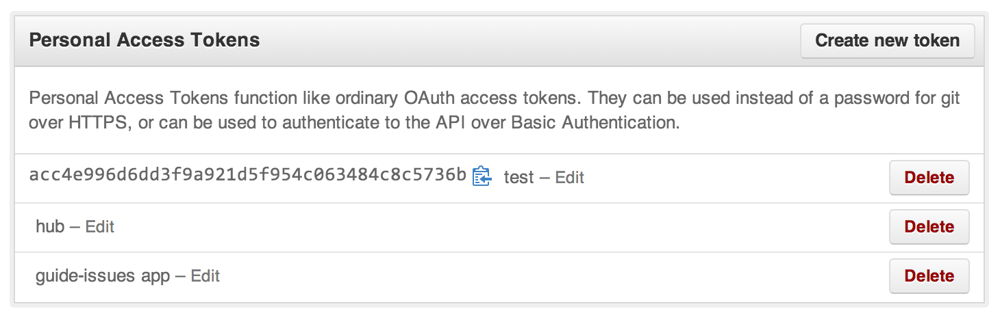

= Issue Aggregator image:https://travis-ci.org/spring-guides/issue-aggregator.svg?branch=master[Build Status,link=https://travis-ci.org/spring-guides/issue-aggregator]

Are you managing multiple projects hosted at GitHub? Wish there was a way to see all the issues for your projects? Then you've come to the right place.

issue-aggregator is a http://spring.io/projects/spring-boot[Spring Boot] application that queries Github for issues across multiple repositories.

== Getting Started

Your first step is registering a GitHub http://spring.io/understanding/oauth[oauth token]. To do that follow these steps:

. Go to https://github.com/settings/applications. (If you don't have a GitHub profile, this app isn't much use, ehh?)
. Underneath *Personal Access Tokens* click https://github.com/settings/tokens/new[Create new token].
. You'll probably get prompted for your password. (That way, your co-worker can't sneak in during your coffee break and create a token without you knowing.)
. In *Token Description* enter something like *issue-aggregator*.
. Click *Create Token*.
. You'll be taken back to the list of apps, and should see a new, cryptic string with an icon offering to copy it to your clipboard similar to that shown below.

== Run the application

Now you can run the application.

----
GITHUB_ACCESS_TOKEN=<passcode> ./mvnw spring-boot:run
----

This works if you run it locally. If you are going to push your app to CloudFoundry, you need to set it as an environment variable. You can do something like this:

----
cf set-env <app_name> GITHUB_ACCESS_TOKEN <passcode>
----

Then you can push all the updates you want. If you roll the passcode, you can simply reissue the command.

You should see something like this:

----
  .   ____          _            __ _ _
 /\\ / ___'_ __ _ _(_)_ __  __ _ \ \ \ \
( ( )\___ | '_ | '_| | '_ \/ _` | \ \ \ \
 \\/  ___)| |_)| | | | | || (_| |  ) ) ) )
  '  |____| .__|_| |_|_| |_\__, | / / / /
 =========|_|==============|___/=/_/_/_/
 :: Spring Boot ::  (v2.2.0.BUILD-SNAPSHOT)

2019-07-30 14:08:19.429  INFO 72673 --- [  restartedMain] i.s.g.i.IssueAggregatorApplicationKt     : Starting IssueAggregatorApplicationKt on retina with PID 72673 (/Users/gturnquist/src/issue-aggregator/target/classes started by gturnquist in /Users/gturnquist/src/issue-aggregator)
2019-07-30 14:08:19.431  INFO 72673 --- [  restartedMain] i.s.g.i.IssueAggregatorApplicationKt     : No active profile set, falling back to default profiles: default
2019-07-30 14:08:19.469  INFO 72673 --- [  restartedMain] .e.DevToolsPropertyDefaultsPostProcessor : Devtools property defaults active! Set 'spring.devtools.add-properties' to 'false' to disable
2019-07-30 14:08:19.469  INFO 72673 --- [  restartedMain] .e.DevToolsPropertyDefaultsPostProcessor : For additional web related logging consider setting the 'logging.level.web' property to 'DEBUG'
2019-07-30 14:08:20.112  INFO 72673 --- [  restartedMain] o.s.b.d.a.OptionalLiveReloadServer       : LiveReload server is running on port 35729
2019-07-30 14:08:20.199  INFO 72673 --- [  restartedMain] o.s.b.web.embedded.netty.NettyWebServer  : Netty started on port(s): 8080
2019-07-30 14:08:20.203  INFO 72673 --- [  restartedMain] i.s.g.i.IssueAggregatorApplicationKt     : Started IssueAggregatorApplicationKt in 0.998 seconds (JVM running for 1.276)
----

You can now see the list of issues at http://localhost:8080.
